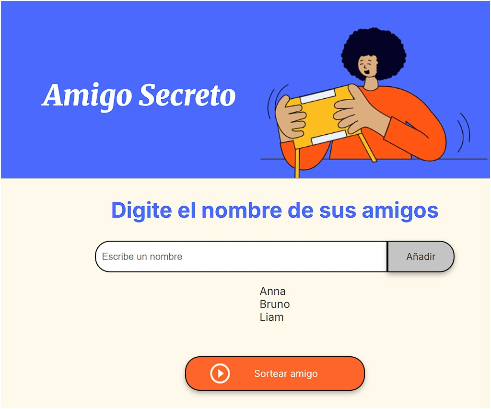
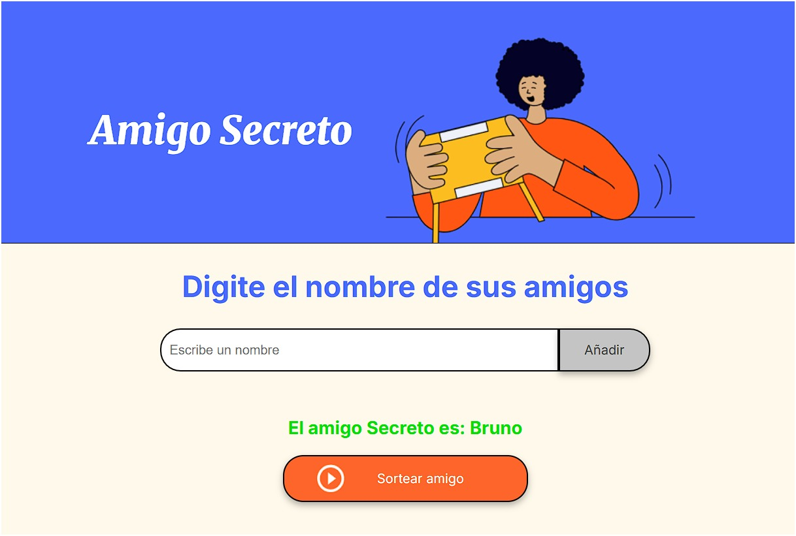

# 🎁 Amigo Secreto

Este proyecto forma parte del Challenge de Principiante en Programación del programa Oracle ONE en Alura. La aplicación permite registrar nombres de participantes y realizar un sorteo aleatorio para asignar un "amigo secreto"

## 🚀 Funcionalidades

- Agregar nombres de participantes
- Visualizar la lista de nombres ingresados
- Sortear aleatoriamente un amigo secreto
- Mostrar como resultado el amigo en secreto en pantalla

## 🛠️ Tecnologías utilizadas

- JavaScript: Lógica de programación

## 📸 Capturas de pantalla

> Ejemplo:
> 
> 

